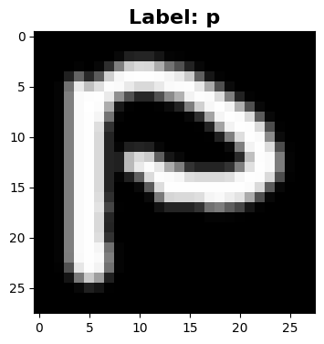
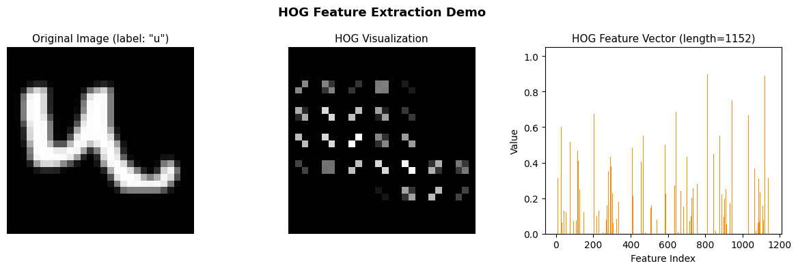
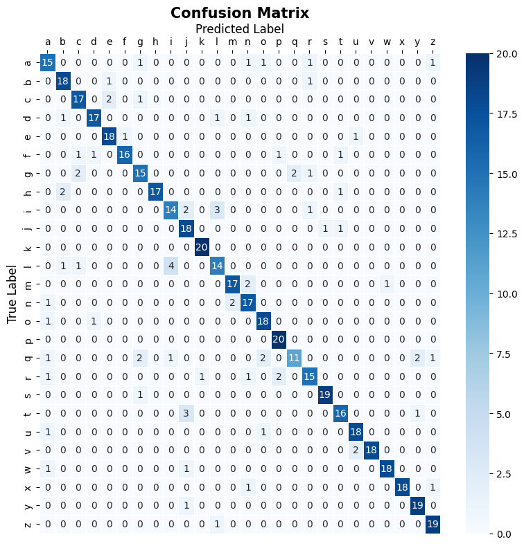

# **EMNIST Handwritten Character Recognition using HOG + SVM**
## 🧠 System Architecture

``` 
Dataset → Preprocessing → HOG Feature Extraction → SVM Training → Evaluation → Prediction
```

## 📂 Dataset
Sample Label: <br>
 <br>
[Click here to get Dataset](https://www.kaggle.com/datasets/crawford/emnist/data)

## ⚙️Parameter

### Histogram of Oriented Gradients (HOG)
 
```
orientations = 8
pixels_per_cell = (4, 4)
cells_per_block = (2, 2)
```

### GridSearchCV
```
BEST PARAMETERS FROM GRID SEARCH
  C         : 10
  gamma     : scale
  kernel    : rbf
```
## 📊 Confusion Matrix
This confusion matrix shows the classification performance on the test set:


## 🖼️ Prediction Visualization
Result from 5 sample prediction:

